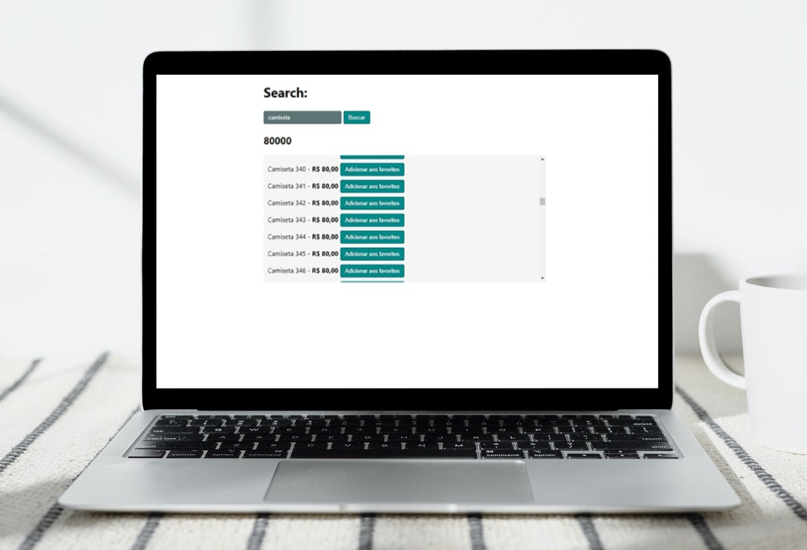

## CICLO BÁSICO DE RENDERIZAÇÃO DO REACT

1. Criar uma nova versão do componente;
2. Comparar com a versão anterior;
3. Se houverem alterações, vai atualizar o que alterou;

## ONDE USAR o memo?

1. Pure Functional Components;
2. Renders too often (que renderizam muitas vezes);
3. Re-renders with same props (que renderizam com mesmas props);
4. Medium to big/large components (que renderizam muitos filhos);

## useMemo / useCallback

### useMEMO:
1. Cálculos pesados;
2. Igualdade referencial (quando a gente repassa aquela informação a um componente filho);

### useCALLBACK:
1. Usado apenas para armazenar uma função. Apenas para igualdade referencial "na memória".

## Dicas:
* Formatar valores antes do componente renderizar e evitar formatar dentro do JSX.
* Usar a biblioteca ``react-virtualized``
* Dynamic import (Code Splitting) é tipo um Lazy Load, ver código abaixo [ver ProductItem.tsx para mais infos]:
```ts
// No next.js é este:
import dynamic from "next/dynamic";

const AddProductToWishlist = dynamic<AddProductToWishlistProps>(() => {
  return import("./AddProductToWishlist"),then(mod => mod.AddProductToWishlist)
});

// No react é o lazy:
import { lazy } from "react";

const AddProductToWishlist = lazy(() => import("./AddProductToWishlist"));

<Suspense fallback={<p>rendering...</p>}>
  <AddProductToWishlist
    onAddToWishlist={() => onAddToWishlist(product.id)}
    onRequestClose={() => setIsAddingToWisthlist(false)}
  />
</Suspense>

// E suporta apenas export DEFAULT da função
// Não precisa passar a tipagem, já vem dentro
// MAS tem que usa ro Suspense
```

## Print pra lembrar :)
<p align="center">
  
</p>